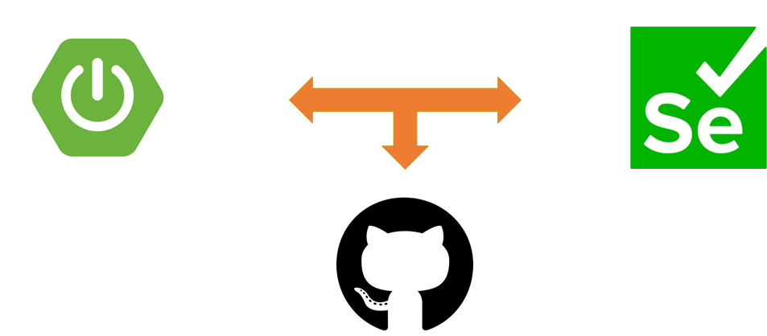

# Spring Boot Selenium with Github



## Description
<ul style="list-style-type:disc">
  <li>It is the usage of Selenium in Spring Boot Application</li>
  <li>Through its usage, the process is automatically tested</li>
  <li>The aim of the example is shown below step by step
      <ul>
        <li>Thanks to JUnit, each process is tested properly and flawlessly</li>
        <li>Each process is tested and implemented by Google Chrome</li>
        <li>Each process is explained in the table shown below</li>
      </ul>
  </li>
</ul>

### Description of the Methods
<table style="width:100%">
  <tr>
    <th>Method</th>
    <th>Description</th>
  </tr>
  <tr>
      <td>login</td>
      <td>Show the implementation of login process through Selenium</td>
  </tr>
  <tr>
      <td>repositoryCheck</td>
      <td>Search and check repository in the Github main page after login through Selenium/td>
  </tr>
  <tr>
      <td>findRepositoryForAuthenticatedUser</td>
      <td>Find Repository by search Parameter in authenticated Github profile page after login through Selenium</td>
  </tr>
  <tr>
      <td>logout</td>
      <td>Show the implementation of logout process after login through Selenium</td>
  </tr>
</table>

### Used Dependencies
* Core
    * Spring
        * Spring Boot
        * Spring Web
* Selenium
* JUnit5
* Web driver manager

### 🔨 Run the App

#### Maven

<b>1 )</b> Download your project from this link shown below
```
    git clone https://github.com/Rapter1990/selenium
```

<b>2 )</b> Go to the project's home directory shown below
```
    cd selenium
```

<b>3 )</b> Create a jar file though this command shown below
```
    mvn clean install
```

<b>4 )</b> Run the project though this command shown below
```
    mvn spring-boot:run
```


### Screenshots

<details>
<summary>Click here to show the screenshots of project</summary>
    <p> Figure 1 </p>
    
    <p> Figure 2 </p>
    
    <p> Figure 3 </p>
    
    <p> Figure 4 </p>
    
</details>    